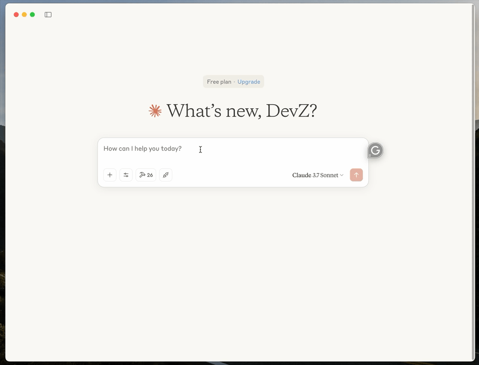
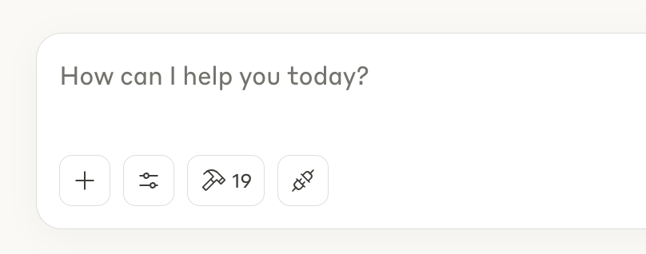
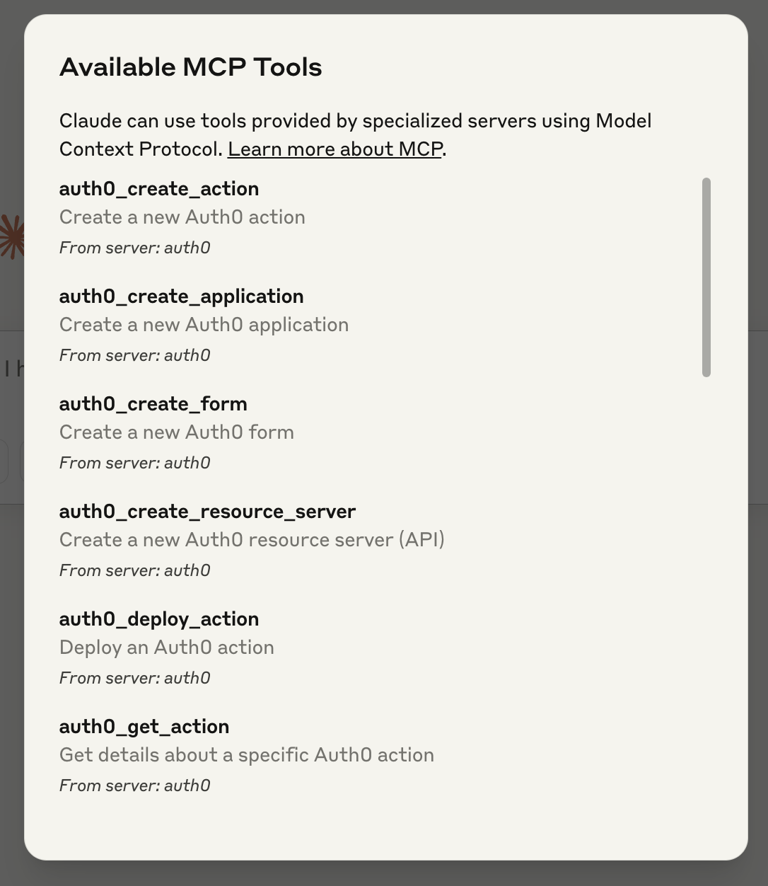
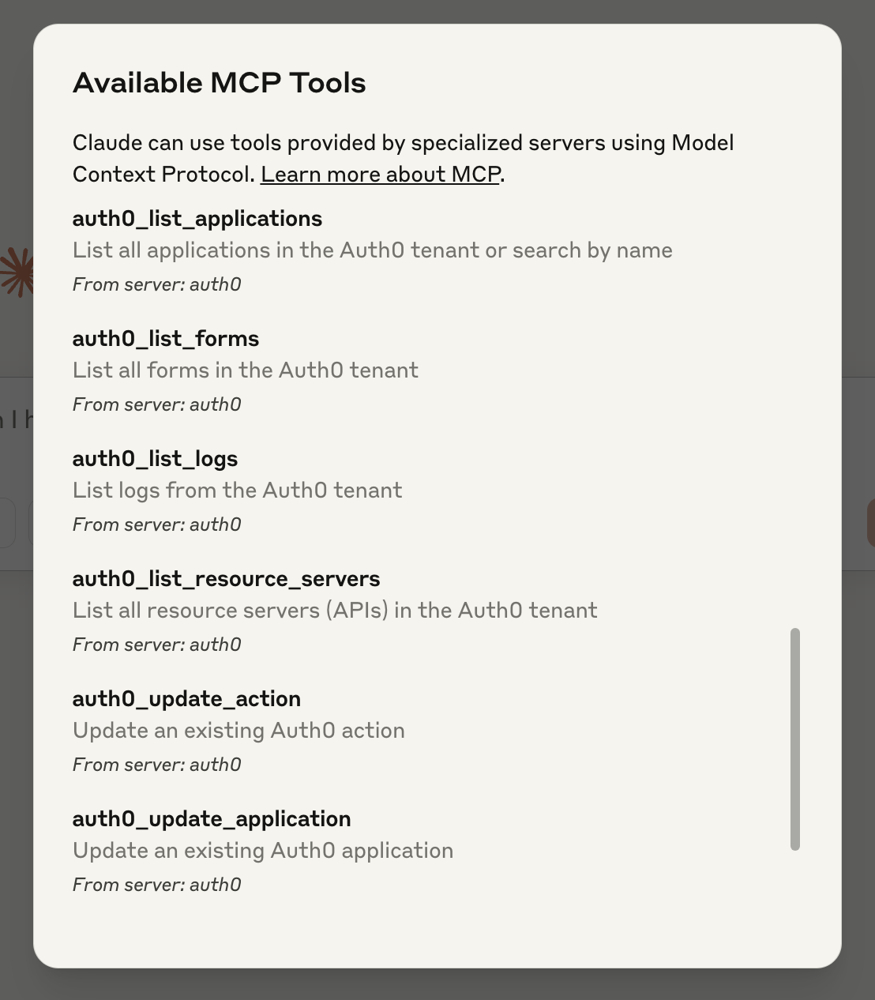
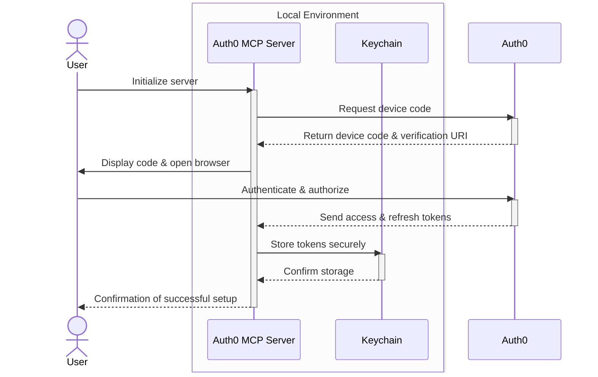

# Auth0 MCP Server

A Model Context Protocol (MCP) server implementation that integrates Auth0 Management API with Claude Desktop, enabling AI-assisted management of your Auth0 tenant.

[](https://opensource.org/licenses/MIT)
[](https://nodejs.org/)

## 📑 Table of Contents

- [Overview](#overview)
- [Quick Start](#quick-start)
  - [Prerequisites](#prerequisites)
  - [Installation](#installation)
  - [Connecting to Claude Desktop](#connecting-to-claude-desktop)
- [Supported Tools](#supported-tools)
  - [Applications](#applications)
  - [Resource Servers](#resource-servers)
  - [Actions](#actions)
  - [Logs](#logs)
  - [Forms](#forms)
- [Architecture](#architecture)
- [Authentication](#authentication)
- [Advanced Usage](#advanced-usage)
  - [Command Line Interface](#command-line-interface)
  - [Operation Modes](#operation-modes)
  - [Configuration](#configuration)
- [Troubleshooting](#troubleshooting)
- [Development](#development)
- [Security](#security)
- [Feedback and Contributing](#feedback-and-contributing)
- [What is Auth0?](#what-is-auth0)
- [License](#license)

## 🌟 Overview

The Auth0 MCP Server allows AI-powered editors like Cursor or Windsurf, or general purpose tools like Claude Desktop to interact with your Auth0 tenant through the Model Context Protocol. This enables Claude to help you manage applications, resource servers, actions, logs, forms, and more within your Auth0 environment.

### ✨ Key Features

- 🔒 **Secure Authentication**: Uses device authorization flow for enhanced security
- 🔑 **Protected Credentials**: Stores credentials in system keychain
- 🧰 **Comprehensive Tools**: Complete set of tools for Auth0 tenant management
- 🤖 **Seamless Integration**: Works directly with Claude Desktop

**_NOTE:_** This server requires Node.js v18 or higher and appropriate Auth0 permissions to function correctly.

## 🚀 Quick Start

### 📋 Prerequisites

- [Node.js v18 or higher](https://nodejs.org/en/download)
- Claude Desktop application
- Auth0 account with appropriate permissions

### 💻 Installation

Install and initialize the Auth0 MCP Server with a single command:

```bash
npx @auth0/auth0-mcp-server init
```

_*Note*: Default configutation is for **Claude Desktop**_

##### For Windsurf

```bash
npx @auth0/auth0-mcp-server init --client windsurf
```

##### For Cursor

```bash
npx @auth0/auth0-mcp-server init --client cursor
```

<br/>

<div align="center">
  
</div>

#### 📖 This will:

1. Start the device authorization flow
2. Open your browser to authenticate with Auth0
3. Store your credentials securely in your system's keychain
4. Configure Claude/Windsurf/Cursor Desktop to use the Auth0 MCP Server

> [!IMPORTANT]
> You'll need to restart Claude/Windsurf/Cursor Desktop after installation for the changes to take effect.

### 🔌 Connecting to Claude Desktop

After installation:

1. Restart Claude Desktop
2. In a conversation with Claude, ask it to help you manage your Auth0 tenant
3. Claude will now have access to your Auth0 environment through the MCP server

<div align="center">
  
</div>

## 🛠️ Supported Tools

The Auth0 MCP Server provides the following tools for Claude to interact with your Auth0 tenant:

<div align="center" style="display: flex; justify-content: center; gap: 20px;">
  
  
</div>

### Applications

| Tool Name                  | Description                                                 |
| -------------------------- | ----------------------------------------------------------- |
| `auth0_list_applications`  | List all applications in the Auth0 tenant or search by name |
| `auth0_get_application`    | Get details about a specific Auth0 application              |
| `auth0_create_application` | Create a new Auth0 application                              |
| `auth0_update_application` | Update an existing Auth0 application                        |

### Resource Servers

| Tool Name                      | Description                                          |
| ------------------------------ | ---------------------------------------------------- |
| `auth0_list_resource_servers`  | List all resource servers (APIs) in the Auth0 tenant |
| `auth0_get_resource_server`    | Get details about a specific Auth0 resource server   |
| `auth0_create_resource_server` | Create a new Auth0 resource server (API)             |
| `auth0_update_resource_server` | Update an existing Auth0 resource server             |

### Actions

| Tool Name             | Description                               |
| --------------------- | ----------------------------------------- |
| `auth0_list_actions`  | List all actions in the Auth0 tenant      |
| `auth0_get_action`    | Get details about a specific Auth0 action |
| `auth0_create_action` | Create a new Auth0 action                 |
| `auth0_update_action` | Update an existing Auth0 action           |
| `auth0_deploy_action` | Deploy an Auth0 action                    |

### Logs

| Tool Name         | Description                     |
| ----------------- | ------------------------------- |
| `auth0_list_logs` | List logs from the Auth0 tenant |
| `auth0_get_log`   | Get a specific log entry by ID  |

### Forms

| Tool Name           | Description                             |
| ------------------- | --------------------------------------- |
| `auth0_list_forms`  | List all forms in the Auth0 tenant      |
| `auth0_get_form`    | Get details about a specific Auth0 form |
| `auth0_create_form` | Create a new Auth0 form                 |
| `auth0_update_form` | Update an existing Auth0 form           |

## 🏛️ Architecture

The Auth0 MCP Server implements the Model Context Protocol, allowing Claude to:

1. Request a list of available Auth0 tools
2. Call specific tools with parameters
3. Receive structured responses from the Auth0 Management API

The server handles authentication, request validation, and secure communication with the Auth0 Management API.

> [!NOTE]
> The server operates as a local process that connects to Claude Desktop, enabling secure communication without exposing your Auth0 credentials.

## 🔐 Authentication

The server uses OAuth 2.0 device authorization flow for secure authentication with Auth0. Your credentials are stored securely in your system's keychain and are never exposed in plain text.



## 🔧 Advanced Usage

### 💻 Command Line Interface

The server provides a CLI with the following commands:

```bash
# Command help
npx @auth0/auth0-mcp-server help

# Initialize the server (authenticate and configure)
npx @auth0/auth0-mcp-server init

# Run the server
npx @auth0/auth0-mcp-server run
```

### 🚥 Operation Modes

#### 🐞 Debug Mode

- More detailed logging
- Enable by setting environment variable: `export DEBUG=auth0-mcp`

**_NOTE:_** Debug mode is particularly useful when troubleshooting connection or authentication issues.

### ⚙️ Configuration

The server stores configuration securely in your system's keychain. No configuration files or environment variables are needed for normal operation.

#### Claude Desktop Configuration

Add this to your `claude_desktop_config.json`:

```json
{
  "mcpServers": {
    "auth0": {
      "command": "npx",
      "args": ["-y", "@auth0/auth0-mcp-server", "run"],
      "capabilities": ["tools"],
      "env": {
        "DEBUG": "auth0-mcp"
      }
    }
  }
}
```

> [!NOTE]  
> _you can manually update if needed or if any unexpected errors occur during the npx init command._

#### Windsurf Desktop Configuration

The `~/.codeium/windsurf/mcp_config.json` file is a JSON file that contains a list of servers that Cascade can connect to.

Add this to your `mcp_config.json`:

```json
{
  "mcpServers": {
    "auth0": {
      "command": "npx",
      "args": ["-y", "@auth0/auth0-mcp-server", "run"],
      "env": {
        "DEBUG": "auth0-mcp"
      }
    }
  }
}
```

> [!NOTE]  
> _you can manually update if needed or if any unexpected errors occur during the npx init command._

#### Cursor Configuration

The `~/.cursor/mcp.json` file is a JSON file that contains a list of MCP servers.

Add this to your `mcp.json`:

```json
{
  "mcpServers": {
    "auth0": {
      "command": "npx",
      "args": ["-y", "@auth0/auth0-mcp-server", "run"],
      "env": {
        "DEBUG": "auth0-mcp"
      }
    }
  }
}
```

> [!NOTE]  
> _you can manually update if needed or if any unexpected errors occur during the npx init command._

## 🩺 Troubleshooting

### 🚨 Common Issues

1. **Authentication Failures**

   - Ensure you have the correct permissions in your Auth0 tenant
   - Try re-initializing with `npx @auth0/auth0-mcp-server init`

2. **Claude Can't Connect to the Server**

   - Restart Claude Desktop after installation
   - Check that the server is running with `ps aux | grep auth0-mcp`

3. **API Errors**
   - Enable debug mode with `export DEBUG=auth0-mcp`
   - Check your Auth0 token permissions and expiration

> [!TIP]
> Most connection issues can be resolved by restarting both the server and Claude Desktop.

#### 📋 Debug logs

Get detailed MCP logs from Claude Desktop:

```sh
# Follow logs in real-time
tail -n 20 -F ~/Library/Logs/Claude/mcp*.log
```

#### 🔍 MCP Inspector

For advanced troubleshooting, use the MCP Inspector:

```sh
npx @modelcontextprotocol/inspector -e DEBUG='auth0-mcp' @auth0/auth0-mcp-server run
```

### 📜 Logs

For detailed logs, run the server in debug mode:

```bash
DEBUG=auth0-mcp npx @auth0/auth0-mcp-server run
```

## 👨‍💻 Development

### 🏗️ Building from Source

```bash
# Clone the repository
git clone https://github.com/auth0/auth0-mcp-server.git
cd auth0-mcp-server

# Install dependencies
npm install

# Build the project
npm run build

# Run the server
npm start
```

> [!NOTE]
> This server requires [Node.js v18 or higher](https://nodejs.org/en/download).

### 🛠️ Configuration Utilities

The Auth0 MCP Server provides utilities to configure Claude Desktop for seamless integration:

```bash
# Update Claude config for local development
npm run local-setup
```

The configuration utility:

- Simplifies the Auth0 MCP server integration with Claude Desktop
- Enables the `tools` capability for Claude's tool-calling features
- Sets up debug environment variables for better troubleshooting
- Automatically backs up your existing configuration

**_NOTE:_** After running the configuration tool, you'll need to restart Claude Desktop for changes to take effect.

## 🔒 Security

The Auth0 MCP Server prioritizes security:

- Credentials are stored in the system's secure keychain
- No sensitive information is stored in plain text
- Authentication uses OAuth 2.0 device authorization flow
- Minimal permissions are requested for API access

**_NOTE:_** Always review the permissions requested during the authentication process to ensure they align with your security requirements.

## 💬 Feedback and Contributing

We appreciate feedback and contributions to this project! Before you get started, please see:

- [Auth0's general contribution guidelines](https://github.com/auth0/open-source-template/blob/master/GENERAL-CONTRIBUTING.md)
- [Auth0's code of conduct guidelines](https://github.com/auth0/open-source-template/blob/master/CODE-OF-CONDUCT.md)

### 🐛 Reporting Issues

To provide feedback or report a bug, please [raise an issue on our issue tracker](https://github.com/auth0/auth0-mcp-server/issues).

### 🔐 Vulnerability Reporting

Please do not report security vulnerabilities on the public GitHub issue tracker. The [Responsible Disclosure Program](https://auth0.com/whitehat) details the procedure for disclosing security issues.

## ❓ What is Auth0?

<p align="center">
  <picture>
    <source media="(prefers-color-scheme: dark)" srcset="https://cdn.auth0.com/website/sdks/logos/auth0_dark_mode.png" width="150">
    <source media="(prefers-color-scheme: light)" srcset="https://cdn.auth0.com/website/sdks/logos/auth0_light_mode.png" width="150">
    
  </picture>
</p>

Auth0 is an easy to implement, adaptable authentication and authorization platform. To learn more checkout [Why Auth0?](https://auth0.com/why-auth0)

## 📄 License

This project is licensed under the MIT license. See the [LICENSE](LICENSE) file for more info.
